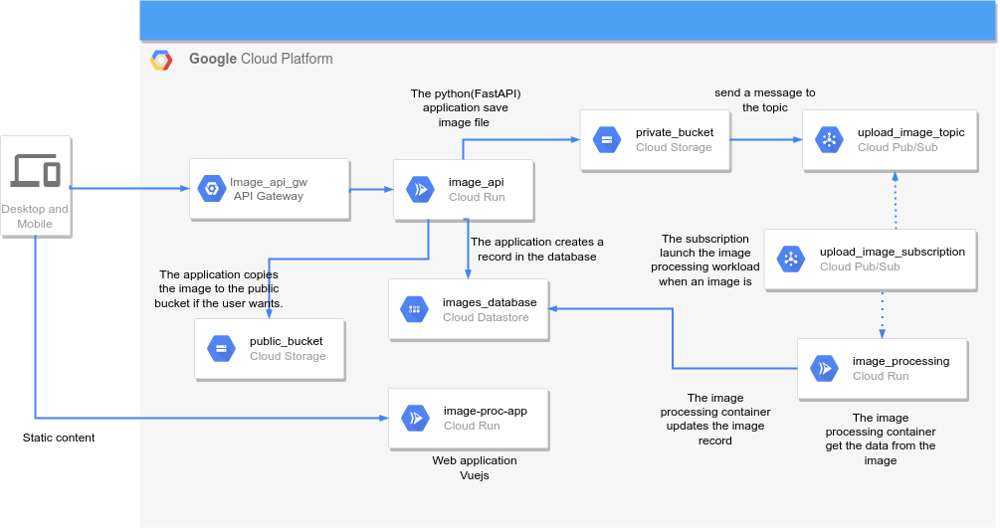

# ibe_lbme_img_proc_infra

This repository contains only the definition of terraform modules used to deploy the infrastructure needed to run the solution to the Image Gallery challenge.
This repository has only a branch, the main branch.




## modules
### cloud_run_deployment
```
├── modules
│   └── cloud_run_deployment
│       ├── cloud_run.tf
│       ├── database.tf
│       ├── gateway.tf
│       ├── iam.tf
│       ├── locals.tf
│       ├── main.tf
│       ├── pubsub.tf
│       ├── registry.tf
│       ├── storage.tf
│       ├── templates
│       │   └── openapi.tftpl
│       └── variables.tf
├── README.md
└── seed
    └── seed-iam.sh

```
This module defines the GCP resources where the workloads will be running. To have multiple environments, the module defines a set of variables to generate the name resources, avoiding hard-coded values.
each file defines the resources needed from each GCP service
The seed folder contains a script for the initial setup.

* `cloud_run.tf` : Defines the cloud run containers 
* `database.tf` : Defines the datastore service
* `gateway.tf` : Creates the API gateway and its configuration
* `iam.tf` : Creates the services accounts and binds the needed roles
* `locals.tf` : Define local variables
* `main.tf` : Defines the google provider
* `pubsub.tf`: Creates the topics and subscriptions
* `registry.tf` Defines the Container Registry service
* `storage.tf` Creates the Storage Buckets
* `templates/openapi.tftpl` The Open API spec to the API gateway.
* `variables.tf` Defines the module variables
